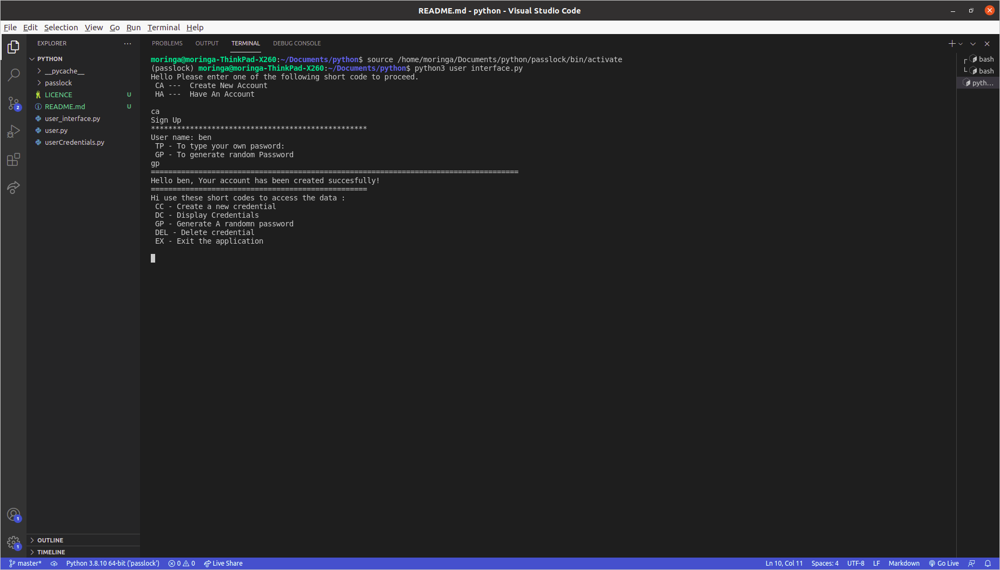

# Password Locker #

## Author ##
Benson Njoroge Mwaniki 
## Description ##
This is a python application to showcase the level of python understanding. This application allows users to create and even generate passwords. The main purpose behind the creation of the app is to help the user save his or her password in it since one might have different accounts, with this app it is easier to manage them.

## preview of the app

## Installation / Setup instruction

The application requires the following installations to operate
* python3.6
* pyperclip
*pip
### Cloning
Open Terminal {Ctrl+Alt+T}

git clone https://github.com/bensammwaniki/password-locker

cd Password-Locker

code .

## Running the Application

To run the application, open the cloned file in terminal and run the following commands:

  $ ./user_interface.py
To run test for the application $ python3 

## Technology used

* python 3.8

## Known bugs 
some problems with data saving

## Contact Information
for any conserns you might have email: bensammwaniki@gmail.com

## Licence
MIT License

Copyright (c) 2021 By Bensam Mwaniki
